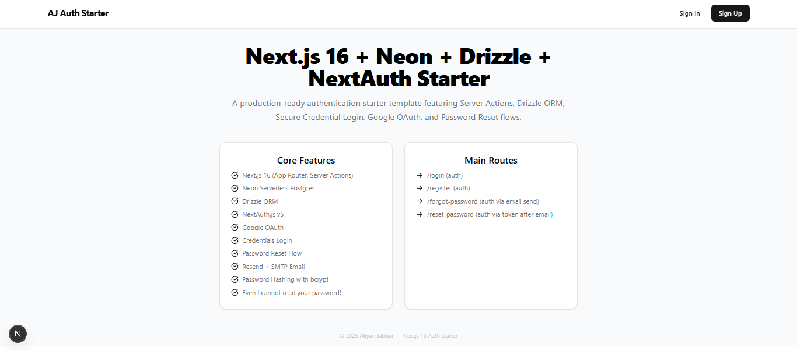
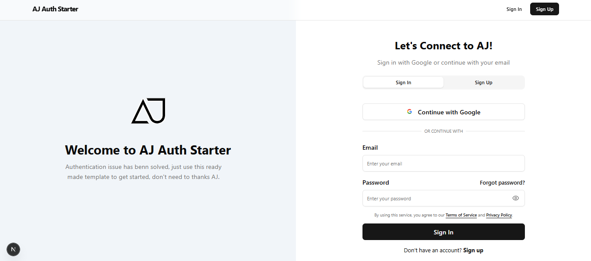
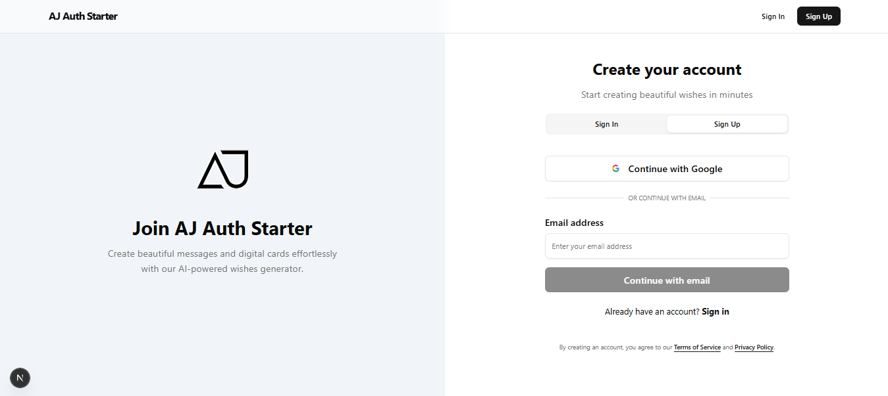
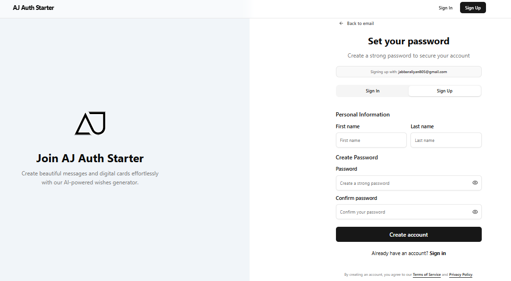
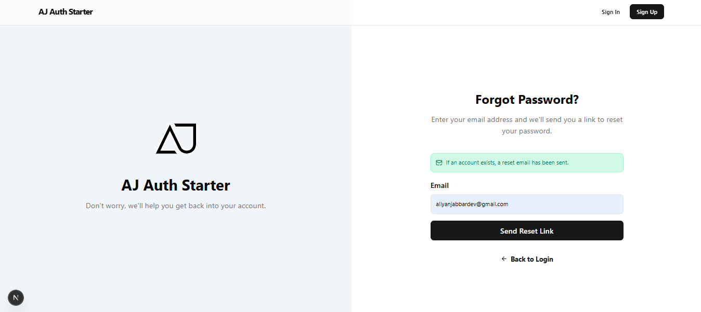
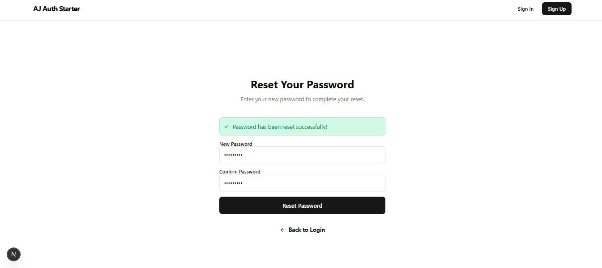

# Next.js 16 Auth Starter (Neon DB + Next Auth)

This is a comprehensive authentication starter template built with the cutting-edge **Next.js 16**, **Neon (Serverless Postgres)**, and **Auth.js v5** (formerly NextAuth).

---

## 🖼️ Screenshots

### Home
[](public/home.png)

### Login
[](public/login.png)

### Register
[](public/register.png)
[](public/register.png)

### Forgot Password
[](public/forgot-password.png)

### Reset Password
[](public/reset-password.png)

---

## 🚀 Features

- **Framework**: Next.js 16.0.3 (App Router + Server Actions)

- **Database**: Neon Serverless Postgres (via Drizzle ORM)

- **Authentication**: Auth.js v5 (next-auth@5.0.0-beta.30)

  - Google OAuth Support
  - Credential Login (Email/Password)
  - Secure Password Hashing (bcryptjs@3.0.3)

- **Flows**:

  - Sign In
  - Sign Up (Registration)
  - Forgot Password (Email w/ nodemailer@7.0.10)

- **UI**:

  - Tailwind CSS
  - Shadcn UI
  - Lucide Icons

---

## 🛠️ Prerequisites

- Node.js 18+ installed
- A [Neon](https://neon.tech) database
- A [Google Cloud](https://console.cloud.google.com/) project
- For Gmail SMTP: **Your Gmail account must have 2-Step Verification enabled**
  (Otherwise **App Passwords will NOT show**, and SMTP will NOT work.)

---

## ⚙️ Environment Setup

Before running the app, you need to configure your environment variables and external services.

---

### **1. Clone and Install**

```bash
git clone <your-repo-url>
cd <your-repo-name>
npm install
```

---

### **2. Set up Environment Variables**

Create a file named **.env.local** in the root of your project:

```
# Database (Neon)
DATABASE_URL=""

# Auth.js (NextAuth)
AUTH_SECRET=""      # Generate using: openssl rand -base64 33
AUTH_GOOGLE_ID=""
AUTH_GOOGLE_SECRET=""

# Email (SMTP for Forgot Password)
SMTP_HOST="smtp.gmail.com"
SMTP_PORT="587"
SMTP_USER="your-email@gmail.com"
SMTP_PASS="your-app-password"

# App URL
NEXT_PUBLIC_APP_URL="http://localhost:3000"
```

---

## 🔑 External Services Setup Guide

---

### **Step 1: Get Neon Database URL**

1. Go to your **Vercel Dashboard**.
2. Click on the **Storage** tab.
3. Click **Create Database** and select **Neon**.
4. Make sure to check the **Auth** option (if available/prompted during setup).
5. Give a name to your database.
   - _Note: On the free tier (Hobby), you cannot change this database name later._
6. Select your region and click **Create**.
7. Once created, go to you database and select **.env.local** tab .
8. Copy the `POSTGRES_URL` (or `DATABASE_URL`) value.
9. Paste it into your local `.env.local` file:
   ```env
   DATABASE_URL="postgres://..."
   ```

---

### **Step 2: Google OAuth Credentials**

1. Go to **Google Cloud Console**
2. Create a new project
3. Visit **APIs & Services → OAuth consent screen**

   - Select External and create.
   - Fill in App Name and Support Email.

4. **Go to Credentials** > **Create Credentials** > **OAuth client ID**.

   - Application type: Web application.
   - Authorized JavaScript origins: http://localhost:3000
   - Authorized redirect URIs: http://localhost:3000/api/auth/callback/google

5. Copy **Client ID** and **Client Secret** into `.env.local`

---

### **Step 3: SMTP Credentials (Gmail Example)**

To send password reset emails:

### ⚠ IMPORTANT

Your Gmail **must have 2-Step Verification enabled**, or the **App Password** option will not appear.

1. Open **Google Account → Security**
2. Enable **2-Step Verification**
3. Go to **App Passwords**
4. Create a password named `"NextAuth"`
5. Copy the **16-character app password**

Update `.env.local`:

```
SMTP_HOST="smtp.gmail.com"
SMTP_PORT="587"
SMTP_USER="your-email@gmail.com"
SMTP_PASS="your-16-char-app-password"
```

---

## 🗄️ Database Setup (Drizzle ORM)

To create required tables (`users`, `accounts`, `sessions`, `passwordResetTokens`):

```bash
npx drizzle-kit push
```

Run this again whenever you modify `src/db/schema.ts`.

---

## 🏃‍♂️ Running the App

Start the development server:

```bash
npm run dev
```

Open:
👉 [http://localhost:3000](http://localhost:3000)

---

## 🧰 View Your Database with Drizzle Studio

If you want a simple local dashboard to view your tables (including all registered users), you can use **Drizzle Studio**.

Run:

```bash
npx drizzle-kit studio
```

---

## 📂 Project Structure

```
src/
 ├─ actions/           # Server Actions (register, reset password, etc.)
 ├─ app/               # App Router (login, register, forgot password)
 ├─ auth.ts            # NextAuth v5 config
 ├─ components/        # Authentication UI | UI
 ├─ components/ui      # UI components shadcn
 ├─ db/                # Database schema + connection
 └─ lib/               # Nodemailer + utilities
```

---

## 🚑 Troubleshooting

### **1. “Relation does not exist”**

Migration not applied:

```bash
npx drizzle-kit push
```

---

### **2. Google Login 400 Error**

Your redirect URI must match **exactly**:

```
http://localhost:3000/api/auth/callback/google
```

---

### **3. Gmail Email Not Sending**

Check:

- Using a **16-character App Password**
- Gmail **2-Step Verification is enabled**
- `SMTP_PORT` is **587**

---

### **4. “Module '@./db/schema' has no exported member...”**

Fix:

- Save `src/db/schema.ts`
- Restart dev server
- Restart your IDE

---

## 🎉 You're Ready!

This starter gives you a **production-ready authentication system** powered by Next.js 16, Neon, and Auth.js v5.

Happy Building! 🚀
